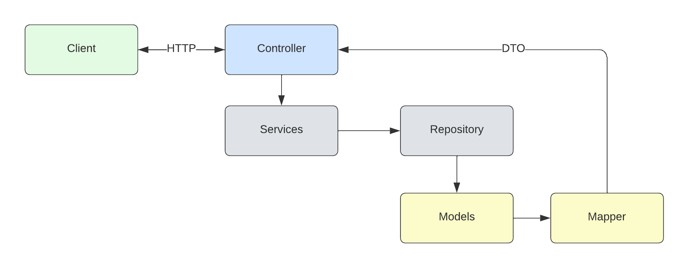

<h1 align="center">
  <span>MovieRank</span>
</h1>
<p align="center">
  <a href="#-project">Project</a>&nbsp;&nbsp;&nbsp;|&nbsp;&nbsp;&nbsp;
  <a href="#-technologies">Technologies</a>&nbsp;&nbsp;&nbsp;|&nbsp;&nbsp;&nbsp;
  <a href="#-setup">Setup</a>&nbsp;&nbsp;&nbsp;|&nbsp;&nbsp;&nbsp;
  <a href="#-structure">Structure</a>&nbsp;&nbsp;&nbsp;|&nbsp;&nbsp;&nbsp;
  <a href="#-license">License</a>
</p>
<br>
<p align="center">
  
</p>

## 🚀 Project

MovieRank is a project that aims to demonstrate the use of Amazon DynamoDB as a managed NoSQL database on AWS, along with .NET Core 6. It presents three different data access models for DynamoDB:

- **Object Persistence Model**: in this model, a library called DynamoDBContext is used, which allows developers to interact with DynamoDB through strongly-typed model classes.
- **Document Model**: in this model, data is stored as JSON documents and accessed through the DocumentModel API, which maps these documents to .NET Core 6 objects.
- **Low Level Model**: in this model, access to DynamoDB is more direct, using the AmazonDynamoDBClient class and the AWSSDK.DynamoDBv2 package.

MovieRank is also a complete project, including a RESTful API developed with ASP.NET Core 6 and documented with Swagger/OpenAPI, as well as unit tests using xUnit and the Moq mocking library. The project structure follows best practices of layered development, dividing it into Controllers, Contracts, Libs, Models, Repositories, and Services.

## 💻 Technologies

This project was developed with the following technologies:

- .NET Core 6.0: a free, open-source, and cross-platform software development platform used to create modern applications for the web, desktop, and mobile devices.
- Amazon DynamoDB: a managed NoSQL database service offered by Amazon Web Services (AWS).
- Entity Framework Core: an ORM (Object-Relational Mapping) framework that allows access to relational databases through C# objects and classes.
- Swashbuckle.AspNetCore: a package for automatic generation of Swagger/OpenAPI documentation for ASP.NET Core APIs.
- Moq: a mocking library for unit testing in .NET.
- xUnit: a unit testing framework for .NET Core.
- FluentAssertions: a library for writing more expressive tests in .NET.
- AWS SDK for .NET: a library for interacting with AWS services on the .NET platform.

## 📥 Setup

To run this project, it is necessary to have an AWS account and configure your credentials in the `appsettings.json` file. In addition, it is necessary to have the .NET Core 6 SDK installed on your machine.

Table Example: 

| UserId | MovieName |                           Description                           |                 Actors                 |    RankedDateTime    | Ranking |
|:------:|:---------:|:---------------------------------------------------------------:|:--------------------------------------:|:--------------------:|:-------:|
|    3   | Fast Draw | When speed is the winner, who will win this fast draw challenge | Daniel Donbavand, Kirsty Donbavand | 5/5/2023 12:31:42 AM |    9    |

Json Example: 

```json
[ 
  {
    "UserId": 3,
    "MovieName": "Fast Draw",
    "Actors": [
      "Daniel Donbavand",
      "Kirsty Donbavand"
    ],
    "Description": "When speed is the winner, who will win this fast draw challenge",
    "RankedDateTime": "5/5/2023 12:31:42 AM",
    "Ranking": 9
  }
]
```

When running the project, the RESTful API will be available for use at `http://localhost:5000` or `https://localhost:5001` (if enabled). The API endpoints are documented and can be accessed through Swagger at `http://localhost:5000/swagger/index.html`.

**Note**: To run the unit tests locally, you will need Docker installed and running on your machine. The tests needs on a local DynamoDB instance that runs within a Docker container. Make sure Docker is up and running before executing the tests.

## 📁 Structure

The project is divided into different layers:

- **Controllers**: the layer responsible for handling HTTP requests and returning the appropriate responses. In this case, requests are made to the RESTful API.
- **Contracts**: the layer that defines the API contracts. These contracts are specifications of how endpoints should be defined and accessed.
- **Libs**: the layer that contains implementations of services and mappers that will be used by the controllers. These services and mappers help process information coming from the endpoints and prepare them to be stored in DynamoDB.
- **Models**: the layer that defines the data models used in the project. These data models are mapped to DynamoDB tables and help structure the stored data.
- **Repositories**: the layer that contains the implementations of the classes responsible for dealing directly with DynamoDB. These classes perform read and write operations on the data stored in the database.
- **Services**: the layer that contains the interfaces and implementations of the services used by the controllers. These services execute the business logic and interact with the repositories to retrieve or store information in the database.

## 📝 License

This project is licensed under the MIT license. See the [LICENSE](LICENSE.md) file for more details.

---

**Developed by [Bruno César](https://github.com/brunocs90).**
